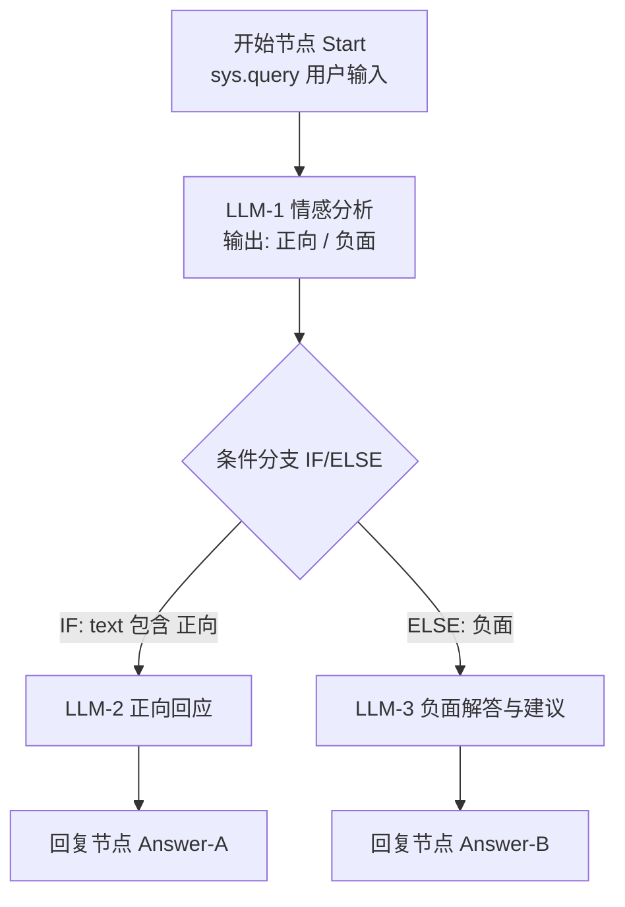

# 作业1 开发文档：Dify 情感分析助手（Chatflow）

> **课程**：第9周 低代码 Agent —— Dify 智能体搭建
> **日期**：2026-09-15
> **提交物**：Chatflow 应用 · 运行截图 · DSL 文件（.yml）

---

## 1. 项目概述

### 1.1 目标

使用 Dify 的 **Chatflow（聊天流）** 模式搭建一个「情感分析助手」，实现根据用户输入的情感倾向进行差异化回复：

| 用户输入情感 | 助手行为 |
| --- | --- |
| **正向** 😊 | 输出温暖回应，并明确包含“希望你明天也很开心” |
| **负面** 😔 | 共情安抚用户，针对用户的困扰进行解答，并给出可执行的建议 |

### 1.2 核心考察点

1. Chatflow 的基本编排能力（节点连线）
2. **条件分支（IF/ELSE）** 节点的使用——实现按情感分流
3. LLM 节点的提示词（Prompt）编写与**变量引用**
4. 应用的测试、运行与 **DSL 导出**

---

## 2. 需求分析

### 2.1 功能需求

- **FR1 输入接收**：接收用户在对话框输入的一段文本（`sys.query`）。
- **FR2 情感判断**：自动判断输入文本的情感倾向（正向 / 负面）。
- **FR3 正向分支**：判断为正向时，输出友好回应，包含语句“希望你明天也很开心”。
- **FR4 负面分支**：判断为负面时，输出内容须包含三部分：
  1. 对用户情绪的共情与安抚；
  2. 针对用户具体困扰的解答；
  3. 具体可行的建议。
- **FR5 多轮对话**：支持上下文连续对话（同一会话内）。

### 2.2 非功能需求

| 项目 | 要求 |
| --- | --- |
| 搭建方式 | 必须使用 **Chatflow**（不能使用 Agent / 文本生成等单节点模式） |
| 回复语言 | 中文 |
| 分类可靠性 | 情感判断输出需格式固定，避免分支误判 |

---

## 3. 总体设计

### 3.1 架构（节点流程图）

采用「**LLM 情感分类 → 条件分支 → 双路回复**」的经典分流结构：



文本版流程：

```
用户输入 (sys.query)
   │
   ▼
[开始 Start]
   │
   ▼
[LLM-1 情感分析]  ── 输出固定格式："正向" 或 "负面"
   │
   ▼
[条件分支 IF/ELSE]
   ├── IF   (LLM-1.text 包含 "正向") ──▶ [LLM-2 正向回应] ──▶ [Answer-A]
   └── ELSE (其余情况，即负面)      ──▶ [LLM-3 负面解答] ──▶ [Answer-B]
```

### 3.2 设计要点说明

| 设计点 | 说明 |
| --- | --- |
| 为什么先用 LLM 分类，再分支？ | IF/ELSE 节点本身不做推理，只能对变量做条件判断；需要 LLM 先把自然语言压缩成固定标签，分支判断才可靠。 |
| 为什么分类输出要用固定词？ | 输出“正向”/“负面”两个词，配合“包含”判断，即使模型附带少量文字也不易误判；比让模型输出 0/1 更直观。 |
| ELSE 分支兜底 | 情感模糊时走 ELSE（按负面处理、给出安抚建议），避免无回复。 |
| 两个独立的 Answer 节点 | Chatflow 中每个分支的回复都应终止于自己的回复节点，保证流式输出正常。 |

---

## 4. 详细搭建步骤

> 前置条件：已部署 Dify（云版 https://cloud.dify.ai 或自部署版），并已在「设置 → 模型供应商」中配置好至少一个对话模型（如 GPT-4o-mini / DeepSeek / 通义千问 / GLM 等）。

### Step 1 创建 Chatflow 应用

1. 登录 Dify，进入工作台，点击 **「创建空白应用」**。
2. 应用类型选择 **「Chatflow」**（聊天流），图标带有对话气泡+流程样式。
3. 应用名称：`情感分析助手`；描述：`根据用户输入的情感倾向自动分流回复的正向鼓励 / 负面疏导助手`。
4. 创建后自动进入编排（Workflow）画布，默认已有「开始」节点。

### Step 2 节点1：开始（Start）

无需额外配置。Chatflow 模式下系统自带变量：

- `sys.query`：用户本轮输入的内容（我们的核心输入）
- `sys.conversation_id`：会话 ID
- `sys.user_id`：用户 ID

> 说明：不需要在开始节点添加自定义输入字段，情感分析直接消费 `sys.query`。

### Step 3 节点2：LLM-1 情感分析

1. 点击画布上「开始」节点下方或空白处的 **`+`**，添加 **LLM** 节点，重命名为 `情感分析`。
2. 连线：`开始` → `情感分析`。
3. 配置：

| 配置项 | 值 |
| --- | --- |
| 模型 | 任选已配置的对话模型（建议 temperature 调低，如 0.1，保证分类稳定） |
| 记忆（MEMORY） | 开启（可选，便于结合上文判断） |
| 视觉 | 关闭 |

**SYSTEM 提示词**（直接复制）：

```
你是一个情感分析器。请判断用户输入文本的情感倾向：
- 如果整体情绪是开心、满意、积极、期待、感激等，输出：正向
- 如果整体情绪是难过、焦虑、愤怒、委屈、迷茫、失落、压力、抱怨等，输出：负面
只输出“正向”或“负面”两个词之一，不要输出任何其他内容，不要加标点。
```

**USER 提示词**：

```
{{#sys.query#}}
```

> 变量插入方法：在输入框中输入 `/` 或 `{`，选择 `sys.query`。

### Step 4 节点3：条件分支（IF/ELSE）

1. 在 `情感分析` 节点后添加 **「条件分支」**（IF/ELSE）节点。
2. 连线：`情感分析` → `条件分支`。
3. 配置 **IF 条件**：

| 配置项 | 值 |
| --- | --- |
| IF 条件 | `情感分析` 节点 → 变量 `text` |
| 判断方式 | **包含（contains）** |
| 判断值 | `正向` |

- **IF（为真）** 分支：判断为正向 → 走正向回复链路。
- **ELSE（否则）** 分支：其余一律视为负面 → 走负面解答链路（兜底策略）。

### Step 5 节点4：LLM-2 正向回应（挂 IF 分支）

1. 在 IF 分支后添加 **LLM** 节点，重命名为 `正向回应`。
2. 连线：`条件分支 IF` → `正向回应`。
3. 配置：

| 配置项 | 值 |
| --- | --- |
| 模型 | 同上，temperature 可设 0.7（语气活泼） |
| 记忆 | 开启 |

**SYSTEM 提示词**：

```
你是一个温暖活泼的陪伴助手。用户刚才表达了正向的情绪，请：
1. 简短回应用户的分享（1-2句，可结合用户原话）；
2. 给出一句真诚的祝福或鼓励；
3. 最后一行必须单独输出：希望你明天也很开心！
回复保持简洁友好，使用中文，不超过80字。
```

**USER 提示词**：

```
用户的输入：{{#sys.query#}}
```

### Step 6 节点5：LLM-3 负面解答（挂 ELSE 分支）

1. 在 ELSE 分支后添加 **LLM** 节点，重命名为 `负面解答与建议`。
2. 连线：`条件分支 ELSE` → `负面解答与建议`。
3. 配置：

| 配置项 | 值 |
| --- | --- |
| 模型 | 同上，temperature 0.5（稳定又自然） |
| 记忆 | 开启 |

**SYSTEM 提示词**：

```
你是一位有同理心的情绪疏导顾问。用户刚才表达了负面情绪，请严格按以下结构回复：

1.【共情安抚】先接纳并肯定用户的情绪，用温暖的语言安抚（1-2句）；
2.【问题解答】针对用户描述的具体困扰，分析可能的原因并给出解答；
3.【行动建议】给出2-3条具体、可立即执行的建议，用列表呈现。

要求：
- 语气真诚、不说教、不敷衍；
- 用中文回复，总长度控制在200字以内；
- 如用户情绪疑似涉及严重心理危机，温和建议寻求专业心理咨询帮助。
```

**USER 提示词**：

```
用户的输入：{{#sys.query#}}
```

### Step 7 节点6/7：两个回复（Answer）节点

1. 在 `正向回应` 后添加 **「回复」** 节点 → 连线 `正向回应` → `Answer-A`。
2. 在 `负面解答与建议` 后添加 **「回复」** 节点 → 连线 `负面解答与建议` → `Answer-B`。
3. 内容填写：

| 节点 | 回复内容 |
| --- | --- |
| Answer-A | `{{#正向回应.text#}}` |
| Answer-B | `{{#负面解答与建议.text#}}` |

> 提示：在回复节点内容框中输入 `/` 或 `{`，选择对应 LLM 节点输出的 `text` 变量。注意 LLM 节点输出需先开启「输出变量」，默认 `text` 即可用。

### Step 8 画布检查清单

- [ ] 所有节点连线完整，无断线、无死路
- [ ] 每个分支都以回复节点结束
- [ ] 变量引用正确（`sys.query`、`text`），节点状态无红点报错
- [ ] 节点命名语义化（`情感分析`、`正向回应`、`负面解答与建议`）
- [ ] 点击右上角 **「预览」**，先跑通两条链路

---

## 5. 测试用例

| 用例编号 | 输入内容 | 预期分支 | 预期输出要点 |
| --- | --- | --- | --- |
| TC-01（正向） | “今天面试通过啦，拿到心仪公司的offer，太开心了！” | IF → 正向回应 | 回应喜悦，末尾包含“希望你明天也很开心！” |
| TC-02（正向） | “周末和好朋友一起去爬山，天气超好，心情美美的” | IF → 正向回应 | 同上 |
| TC-03（负面） | “最近项目天天加班，感觉撑不住了，好累好焦虑” | ELSE → 负面解答 | 共情 + 分析 + 2-3条建议 |
| TC-04（负面） | “和室友闹矛盾了，她说我老是打扰她，我很难过” | ELSE → 负面解答 | 共情 + 分析 + 2-3条建议 |
| TC-05（模糊兜底） | “今天食堂的菜一般般” | ELSE（兜底） | 正常安抚/回应，不报错、不空白 |
| TC-06（多轮） | 先输入 TC-03，再输入“谢谢你，我感觉好一些了” | IF → 正向回应 | 结合上文，回应情绪好转 |

**测试方法**：右上角「预览 / 运行」进入调试对话，逐条输入用例，观察实际走的分支（画布上会高亮执行路径）并核对输出。

---

## 6. 运行截图指引（提交物1）

在「预览」对话中完成以下截图，建议每张包含 **完整对话窗口 + 右侧画布执行高亮路径**：

| 截图编号 | 内容 |
| --- | --- |
| 截图1 | Chatflow 画布总览（能看到全部 7 个节点与连线） |
| 截图2 | TC-01 正向输入 → 正向回复（含“希望你明天也很开心！”），画布高亮 IF 分支 |
| 截图3 | TC-03 负面输入 → 共情+解答+建议，画布高亮 ELSE 分支 |
| 截图4 | （可选）TC-06 多轮对话效果 |

> 截图建议使用 `Cmd+Shift+4`（macOS）或 `Win+Shift+S`（Windows）框选，保证文字清晰可读。

---

## 7. DSL 导出与提交（提交物2）

1. 确认所有测试通过后，点击画布右上角 **「发布」** 旁的 **「导出 DSL」**（部分版本在「…更多」菜单中）。
2. 下载得到 `情感分析助手.yml` 文件（内含完整的节点编排、提示词与变量配置）。
3. **自检 DSL**：用文本编辑器打开，确认以下字段存在——
   - `app.mode: advanced-chat`（即 Chatflow）
   - `workflow.graph.nodes` 中包含 `start`、`llm`、`if-else`、`answer` 节点
4. 提交内容打包：

```
提交目录/
├── homework1_开发文档.md        # 本文档
├── 情感分析助手.yml             # 导出的 DSL
├── 截图1_画布总览.png
├── 截图2_正向分支.png
├── 截图3_负面分支.png
└── （可选）截图4_多轮对话.png
```

---

## 8. 验收标准（Self-Check）

| # | 验收项 | 是否达成 |
| --- | --- | --- |
| 1 | 使用 Chatflow（而非 Agent/聊天助手）模式搭建 | ☐ |
| 2 | 包含情感判断逻辑（LLM 分类 + 条件分支） | ☐ |
| 3 | 正向输入 → 输出包含“希望你明天也很开心” | ☐ |
| 4 | 负面输入 → 输出包含共情、解答、建议三要素 | ☐ |
| 5 | 测试用例全部通过，模糊输入有兜底 | ☐ |
| 6 | 已按指引截图（画布 + 两条分支运行效果） | ☐ |
| 7 | 已导出 DSL 并校验 `advanced-chat` 模式 | ☐ |

---

## 9. 常见问题（FAQ）

**Q1：IF/ELSE 判断总不生效，正负都走同一边？**
A：检查三处——① 分类 LLM 的 SYSTEM 提示词是否要求“只输出 正向/负面”；② IF 条件的判断方式是否选了“包含”且值为“正向”；③ 模型 temperature 是否过高导致输出夹带其他文字（建议降到 0.1）。

**Q2：回复节点引用变量后无输出？**
A：确认引用的是 LLM 节点的 `text` 输出变量；确认该 LLM 节点确实连线到对应回复节点。

**Q3：一个 Answer 能接两个分支吗？**
A：不建议。两条链路独立各配一个回复节点，结构更清晰，也避免变量引用冲突。

**Q4：能否不用 LLM 分类，直接用「问题分类器」节点？**
A：可以。Dify Chatflow 提供「问题分类器（Question Classifier）」节点，可定义 `正向情绪` / `负面情绪` 两个分类标签，直接接入两条下游链路。两种方案均满足作业要求；本方案（LLM+IF/ELSE）更能体现条件分支的考察点，推荐使用。

**Q5：DSL 导出后想再修改怎么办？**
A：在 Dify 中可直接导入 DSL 恢复应用（创建应用时选「导入 DSL 文件」），修改后再次导出覆盖即可。

---

## 10. 参考资料

- Dify 官方文档 - 工作流 / Chatflow：https://docs.dify.ai/zh-hans/guides/workflow
- Dify 官方文档 - 条件分支节点：https://docs.dify.ai/zh-hans/guides/workflow/node/ifelse
- Dify 官方文档 - LLM 节点：https://docs.dify.ai/zh-hans/guides/workflow/node/llm
- Dify 官方文档 - 问题分类器：https://docs.dify.ai/zh-hans/guides/workflow/node/question-classifier
