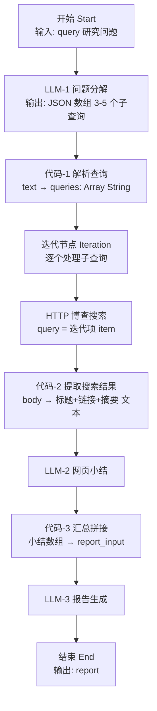

# 作业2 开发文档：Dify DeepResearch 深度研究工作流

> **课程**：第9周 低代码 Agent —— Dify 智能体搭建
> **日期**：2026-09-15
> **需求来源**：根目录 `homework` 文件（`homework2/homework_content` 当前为空，需求以根目录文件为准）
> **提交物**：Workflow 应用 · 运行截图 · DSL 文件（.yml）

---

## 1. 项目概述

### 1.1 目标

使用 Dify 搭建一个 **DeepResearch（深度研究）工作流**：用户输入一个研究问题，系统自动完成

**问题分解 → 博查（Bocha）联网搜索 → 网页内容总结 → 汇总 → 生成结构化研究报告**

### 1.2 核心考察点

1. **Workflow（工作流）模式**的编排能力（区别于作业1的 Chatflow）
2. **迭代节点（Iteration）**——对多个子查询循环执行"搜索+总结"
3. **HTTP 请求节点**——直接调用外部 REST API（博查搜索，Bearer 鉴权）
4. **代码节点（Code）**——JSON 解析与数据清洗
5. 多节点变量的传递与汇总、最终报告生成

---

## 2. 需求分析

### 2.1 功能需求

| 编号 | 需求 | 说明 |
| --- | --- | --- |
| FR1 | 接收用户问题 | 开始节点提供文本输入 `query` |
| FR2 | 问题分解 | 将问题拆解为 3-5 个互补的搜索子查询（覆盖不同侧面） |
| FR3 | 博查搜索 | 对每个子查询调用 `POST https://api.bocha.cn/v1/web-search`，开启 `summary`，取前 10 条结果 |
| FR4 | 网页总结 | 对每个子查询的搜索结果提炼一段客观小结，附来源 |
| FR5 | 汇总 | 合并所有小结，交叉整理 |
| FR6 | 生成报告 | 输出结构化 Markdown 报告（背景/关键发现/综合分析/结论与建议/参考来源） |
| FR7 | 容错 | 搜索无结果、输入无意义时流程不崩溃，报告如实说明 |

### 2.2 非功能需求

| 项目 | 要求 |
| --- | --- |
| 搭建方式 | 使用 **Workflow**（工作流）模式，必须包含**迭代节点**与 **HTTP 请求节点** |
| 搜索 API | 博查 web-search（课程已提供 key 与 curl 示例） |
| 报告语言 | 中文，Markdown 格式 |
| 安全 | API Key 不写入公开仓库，提交 DSL 前确认可接受（课程环境内使用） |

---

## 3. 总体设计

### 3.1 架构（节点流程图）



文本版流程：

```
用户问题 (开始节点变量 query)
   │
   ▼
[LLM-1 问题分解]      输出 JSON 数组，如 ["背景与定义","市场规模数据","对比分析"]
   │
   ▼
[代码-1 解析查询]      把 JSON 数组解析为 Array[String]（带兜底）
   │
   ▼
[迭代 Iteration]  ←── 输入: queries 数组
   │   （每个子查询循环执行一遍 ↓）
   ├─▶ [HTTP-博查搜索]     body = {"query": 迭代项, "summary": true, "count": 10}
   ├─▶ [代码-2 提取结果]   从响应 JSON 提取 标题/链接/摘要 拼为文本
   └─▶ [LLM-2 网页小结]    生成该子问题的研究小结
   │
   ▼  迭代输出 = 各小结组成的数组
[代码-3 汇总拼接]      小结数组 → 带编号的一段文本
   │
   ▼
[LLM-3 报告生成]       结构化 Markdown 研究报告
   │
   ▼
[结束]                 report = LLM-3.text
```

### 3.2 设计要点

| 设计点 | 说明 |
| --- | --- |
| 为什么先分解再迭代？ | 单次搜索视角单一；分解成 3-5 个子查询分别搜索再汇总，才符合 DeepResearch"多路检索、交叉验证"的思想，也正是迭代节点的用武之地。 |
| 为什么用 LLM 输出 JSON 数组？ | 迭代节点的输入必须是**数组**。让 LLM 直接产出 `["q1","q2",...]`，代码节点解析+兜底（解析失败时退化为原始问题整句搜索），保证流程永不断流。 |
| 为什么加"代码-2 提取结果"？ | 博查返回的是嵌套 JSON（`data.webPages.value[]`）。先在代码节点里提取成"标题+链接+摘要"纯文本，LLM 总结更省 token、更聚焦，也避免超长 body 截断。 |
| 并行策略 | 迭代节点可开并行（提高速度），但博查 API 有频率限制，建议先**关闭并行**跑通，必要时再开、并行数设 2-3。 |
| 错误处理 | 迭代节点开启"忽略错误继续"；LLM-2 对无关结果输出固定话术，保证报告始终能生成。 |
| Workflow vs Chatflow | 本作业是"一问一报告"的一次性任务，用 **Workflow** 模式最合适（作业1的 Chatflow 面向多轮对话）。 |

---

## 4. 详细搭建步骤

> **前置条件**：
> 1. 课程 Dify 环境 http://47.76.83.42/ （或本地部署实例），已在「设置 → 模型供应商」配置对话模型；
> 2. 博查 API Key（见根目录 `homework` 文件中的 curl 示例，形如 `sk-xxxx`）；可先到博查开放平台 https://open.bochaai.com 验证 key 有效性；
> 3. Dify 版本 ≥ 0.8（含迭代节点；课程 2026 环境均满足）。

### Step 1 创建 Workflow 应用

1. 工作台 → **创建空白应用** → 选择 **「Workflow」（工作流）**。
2. 名称：`DeepResearch 深度研究助手`；描述：`输入研究问题，自动分解子查询、博查联网搜索、网页总结并生成结构化研究报告`。
3. 进入画布，默认已有「开始」节点。

### Step 2 节点1：开始（Start）

添加**输入字段**：

| 字段 | 值 |
| --- | --- |
| 变量名 | `query` |
| 显示名称 | `研究问题` |
| 类型 | 段落（paragraph，长文本） |
| 必填 | 是 |
| 最大长度 | 2000 |

### Step 3 节点2：LLM-1 问题分解

1. 添加 **LLM** 节点，命名 `问题分解`；连线 `开始` → `问题分解`。
2. 配置：模型任选，**temperature 0.1**（保证输出格式稳定）。

**SYSTEM 提示词**（直接复制）：

```
你是深度研究助手的问题规划器。请把用户的研究问题分解为 3-5 个互补的搜索查询词：
- 覆盖问题的不同侧面（如：背景与定义、现状与关键数据、对比分析、典型案例、最新进展与趋势）；
- 每个查询词是简短的中文搜索短语（8-20字），适合搜索引擎检索；
- 只输出一个 JSON 字符串数组，例如：["新能源汽车 2026 市场规模","新能源汽车 销量数据 2026","新能源汽车 行业趋势分析"]
- 不要输出任何解释文字，不要输出 markdown 代码块。
```

**USER 提示词**：

```
{{#开始.query#}}
```

> 变量插入：在输入框中输入 `/` 或 `{`，通过变量选择器选择 **开始节点 → query**（编辑器会自动生成 `{{#节点ID.query#}}` 形式的引用，下同）。

### Step 4 节点3：代码-1 解析查询

1. 添加 **代码（Code）** 节点，命名 `解析查询`；连线 `问题分解` → `解析查询`。
2. 输入变量：`text` ← `问题分解 / text`（LLM 输出）。
3. 输出变量：`queries`，类型 **Array[String]**。
4. 执行语言 Python3，代码：

```python
import json
import re

def main(text: str) -> dict:
    t = (text or "").strip()
    # 去掉可能存在的 markdown 代码块包裹
    t = re.sub(r'^```(?:json)?\s*', '', t)
    t = re.sub(r'\s*```$', '', t).strip()
    m = re.search(r'\[.*\]', t, re.S)
    if m:
        t = m.group(0)
    try:
        arr = json.loads(t)
    except Exception:
        # 兜底：解析失败则用原始问题整句搜索，保证流程不断
        arr = [(text or "").strip()]
    queries = [str(x).strip() for x in arr if str(x).strip()][:5]
    if not queries:
        queries = [""]
    return {"queries": queries}
```

### Step 5 节点4：迭代节点（Iteration）

1. 添加 **迭代（Iteration）** 节点，命名 `研究子问题循环`；连线 `解析查询` → 迭代节点。
2. 配置：

| 配置项 | 值 |
| --- | --- |
| 输入变量（迭代对象） | `解析查询 / queries`（Array[String]） |
| 输出变量（输出选择器） | 选迭代体内最后一个节点 **LLM-2 网页小结** 的 `text` |
| 迭代并行 | 先关闭（跑通后再开，并行数 ≤ 3） |
| 错误处理 | 开启「忽略错误继续」 |

3. 迭代体内再添加以下 3 个节点（注意都加在**迭代框内部**，入口自动是迭代的 item）。

#### 5.1 迭代内：HTTP-博查搜索

添加 **HTTP 请求** 节点，命名 `博查搜索`，配置：

| 配置项 | 值 |
| --- | --- |
| Method | `POST` |
| URL | `https://api.bocha.cn/v1/web-search` |
| Headers | `Authorization:Bearer sk-你的key`（换行）`Content-Type:application/json` |
| Body 类型 | JSON（raw） |

Body 内容（`query` 通过变量选择器插入**迭代 → item**，即当前子查询）：

```json
{
  "query": "{{#迭代.item#}}",
  "summary": true,
  "count": 10
}
```

> 对应课程提供的 curl 示例：
> `curl -X POST "https://api.bocha.cn/v1/web-search" -H "Authorization: Bearer sk-xxx" -H "Content-Type: application/json" -d '{"query":"...","summary":true,"count":10}'`
> 响应结构：`data.webPages.value[]`，每项含 `name`（标题）、`url`、`summary`（AI 摘要）、`snippet`（片段）。

#### 5.2 迭代内：代码-2 提取搜索结果

1. 添加 **代码** 节点，命名 `提取搜索结果`；连线 `博查搜索` → `提取搜索结果`。
2. 输入变量：`body` ← `博查搜索 / body`（HTTP 节点响应体）。
3. 输出变量：`result`，类型 **String**。
4. Python3 代码：

```python
import json

def main(body: str) -> dict:
    try:
        data = json.loads(body)
    except Exception:
        return {"result": ""}
    pages = (data.get("data") or {}).get("webPages", {}).get("value") or []
    lines = []
    for i, p in enumerate(pages[:10], 1):
        name = p.get("name", "")
        url = p.get("url", "")
        summary = p.get("summary") or p.get("snippet") or ""
        if summary:
            lines.append(f"{i}. {name}\n   链接: {url}\n   摘要: {summary}")
    return {"result": "\n\n".join(lines) if lines else ""}
```

#### 5.3 迭代内：LLM-2 网页小结

1. 添加 **LLM** 节点，命名 `网页小结`；连线 `提取搜索结果` → `网页小结`。
2. 配置：temperature 0.3。

**SYSTEM 提示词**：

```
你是研究助理。针对给定的子问题，从网页搜索结果中提取有效信息并形成一段客观小结。

要求：
1. 优先使用搜索结果中的 summary 字段，其次 snippet；
2. 提炼与子问题直接相关的事实、数据、观点，保留关键数字与结论；
3. 在小结末尾列出2-3条主要来源（标题 + URL）；
4. 用中文输出，150-250字；
5. 若搜索结果与子问题无关或为空，只输出：未找到与该子问题相关的有效信息。
```

**USER 提示词**：

```
子问题：{{#迭代.item#}}

搜索结果：
{{#提取搜索结果.result#}}
```

### Step 6 节点5：代码-3 汇总拼接

1. 退出迭代框，添加 **代码** 节点，命名 `汇总拼接`；连线 **迭代节点** → `汇总拼接`。
2. 输入变量：`summaries` ← `迭代 / output`（迭代输出，Array[String]）。
3. 输出变量：`report_input`，类型 **String**。
4. Python3 代码：

```python
def main(summaries: list) -> dict:
    parts = []
    idx = 0
    for s in summaries or []:
        s = str(s or "").strip()
        if not s:
            continue
        idx += 1
        parts.append(f"【子课题 {idx}】\n{s}")
    if not parts:
        parts = ["（未获得任何有效研究小结）"]
    return {"report_input": "\n\n".join(parts)}
```

### Step 7 节点6：LLM-3 报告生成

1. 添加 **LLM** 节点，命名 `报告生成`；连线 `汇总拼接` → `报告生成`。
2. 配置：temperature 0.4。

**SYSTEM 提示词**：

```
你是一名资深研究员。请基于提供的各子课题研究小结，撰写一份结构化研究报告。

报告使用 Markdown 格式，包含以下部分：
## 一、研究背景 —— 简述研究问题及其价值（2-3句）
## 二、关键发现 —— 按3-5个要点归纳各子课题的核心信息
## 三、综合分析 —— 交叉对比各来源信息，指出共识、分歧与信息缺口
## 四、结论与建议 —— 给出明确结论和后续行动建议
## 五、参考来源 —— 列出小结中出现的来源标题与URL

要求：
- 语言客观、信息密度高，总长度800-1200字；
- 不得编造小结之外的事实，来源不足处如实说明；
- 使用中文。
```

**USER 提示词**：

```
研究问题：{{#开始.query#}}

各子课题研究小结：
{{#汇总拼接.report_input#}}
```

### Step 8 节点7：结束（End）

1. 添加 **结束** 节点；连线 `报告生成` → `结束`。
2. 输出变量：`report` ← `报告生成 / text`。

### Step 9 画布检查清单

- [ ] 节点连线完整：开始 → 分解 → 解析 → 迭代 → 汇总 → 报告 → 结束，无断线
- [ ] 3 个迭代内节点都在**迭代框内部**，且迭代体的输出选择器指向 `网页小结/text`
- [ ] HTTP 节点的 Headers 填了 Bearer Key，Body 中 `query` 引用的是**迭代 item**
- [ ] 代码节点的输入变量选择器、输出变量名与文档一致
- [ ] 所有节点无红色报错；右上角「运行」试跑通过

---

## 5. 测试用例

| 用例编号 | 输入 | 预期 |
| --- | --- | --- |
| TC-01 基础事实型 | `天空为什么是蓝色的？` | 分解出 3-5 个子查询（如瑞利散射原理/不同时段颜色/其他行星天空对比），各子查询有小结，报告结构完整 |
| TC-02 时效型 | `2026年新能源汽车行业有哪些新趋势？` | 报告包含最新数据与来源链接 |
| TC-03 对比型 | `RAG 和微调各有什么优缺点？企业应该怎么选？` | 综合分析部分出现对比与选型建议 |
| TC-04 异常兜底 | `asdfgh123` | 流程不报错；小结可能为"未找到有效信息"，报告如实说明 |
| TC-05 数量校验 | `如何选择适合中小企业的大模型部署方案？` | 检查「解析查询」节点输出数组长度为 3-5 |

> 运行方法：右上角「运行」→ 填入 `研究问题` → 查看各节点执行状态（绿色=成功），点击节点可查看输入输出详情。

---

## 6. 运行截图指引（提交物1）

| 截图编号 | 内容 |
| --- | --- |
| 截图1 | 画布总览（能看到迭代节点内部展开的 3 个子节点与全部连线） |
| 截图2 | 运行详情：`问题分解` + `解析查询` 节点的输入输出（能看到子查询 JSON 数组） |
| 截图3 | 运行详情：迭代节点执行过程（展开任一轮，可见 HTTP 请求与该轮小结输出） |
| 截图4 | 运行详情：`报告生成` 输出 + 结束节点 `report`（完整报告，含参考来源） |

> 迭代节点展开方法：运行完成后点击迭代节点，可查看每一轮迭代的执行详情；确保截图中能看到 HTTP 节点返回 200。

---

## 7. DSL 导出与提交（提交物2）

1. 全部测试通过后，点击右上角 **「导出 DSL」**，得到 `DeepResearch深度研究助手.yml`。
2. **自检 DSL**：文本编辑器打开确认——
   - `app.mode: workflow`
   - 节点类型包含 `start`、`llm`、`code`、`http-request`、`iteration`、`end`
3. 提交内容打包：

```
提交目录/
├── homework2_开发文档.md           # 本文档
├── DeepResearch深度研究助手.yml    # 导出的 DSL
├── 截图1_画布总览.png
├── 截图2_问题分解.png
├── 截图3_迭代搜索总结.png
└── 截图4_最终报告.png
```

---

## 8. 验收标准（Self-Check）

| # | 验收项 | 是否达成 |
| --- | --- | --- |
| 1 | 使用 Workflow 模式，含迭代节点 | ☐ |
| 2 | 问题自动分解为 3-5 个子查询 | ☐ |
| 3 | 通过 HTTP 请求节点调用博查搜索（Bearer 鉴权，summary=true） | ☐ |
| 4 | 每个子查询生成网页小结 | ☐ |
| 5 | 汇总生成结构化报告（背景/发现/分析/结论/参考来源） | ☐ |
| 6 | 异常输入不崩溃（TC-04） | ☐ |
| 7 | 已按指引截图（含迭代执行详情） | ☐ |
| 8 | 已导出 DSL 并校验 `workflow` 模式 | ☐ |

---

## 9. 常见问题（FAQ）

**Q1：HTTP 节点返回 401 Unauthorized？**
A：检查 Headers 是否为 `Authorization:Bearer sk-xxx`（注意 `Bearer` 后有一个空格、冒号后不要加空格）；确认 key 未过期，可先用文档中的 curl 命令在终端验证。

**Q2：迭代节点输出为空？**
A：检查「输出选择器」是否选到了迭代体内 `网页小结` 节点的 `text`；确认迭代输入是 Array 类型（来自代码-1 的 `queries`），而不是字符串。

**Q3：代码-1 解析查询报错或结果只有 1 条？**
A：说明 LLM-1 没按格式输出 JSON 数组。代码已做兜底（整句搜索），同时把 LLM-1 的 temperature 降到 0.1；也可在提示词中强调"只输出 JSON 数组"。

**Q4：HTTP 的 body 太长，LLM 总结被截断？**
A：这就是设置"代码-2 提取结果"的原因——只把标题+链接+摘要传给 LLM。若仍过长，把 `count` 从 10 降到 5。

**Q5：迭代跑得慢或被限流？**
A：博查 API 有并发/频率限制。迭代并行先关闭；确需提速再开并行并设 2-3，或给 HTTP 节点配置重试。

**Q6：能否用 Dify 市场里的「博查搜索」插件（工具节点）代替 HTTP 请求节点？**
A：可以。市场中有博查官方插件，装好后用工具节点传入 query 即可。但作业给出了 curl 示例，使用 **HTTP 请求节点**更能体现 API 调用与鉴权原理，推荐主方案。

**Q7：不用迭代节点行不行？**
A：不推荐（迭代是本作业核心考察点）。若实在无法使用，可退化为简化版：LLM-1 把问题改写为 1 个最优搜索词 → 单次博查搜索 → 单次总结 → 报告生成。功能满足"搜索+总结+报告"，但少了"分解多路"环节，验收标准第 1、2 项将不达标。

**Q8：API Key 要保密吗？**
A：要。Key 只写在课程环境/作业提交物内，不要提交到公开仓库或分享到群外；如泄露请及时在博查平台重置。

---

## 10. 参考资料

- Dify 官方文档 - 迭代节点：https://docs.dify.ai/zh-hans/guides/workflow/node/iteration
- Dify 官方文档 - HTTP 请求节点：https://docs.dify.ai/zh-hans/guides/workflow/node/http
- Dify 官方文档 - 代码节点：https://docs.dify.ai/zh-hans/guides/workflow/node/code
- Dify 官方文档 - 变量：https://docs.dify.ai/zh-hans/guides/workflow/variable
- 博查搜索 API：https://open.bochaai.com （web-search 接口文档）
