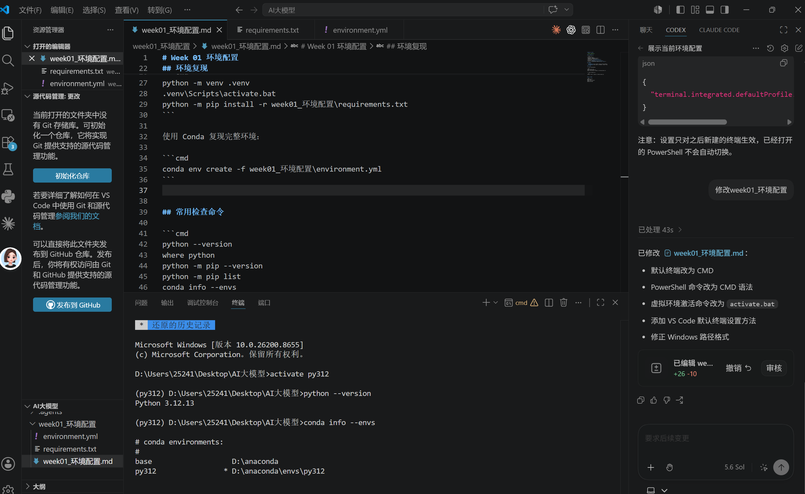

# Week 01 环境配置

> 采集日期：2026-07-17


## 当前 Python 环境

| 配置项 | 当前值 |
| --- | --- |
| 操作系统 | Windows |
| 默认终端 | CMD（Command Prompt） |
| Python 版本 | Python 3.12.7 |
| Python 解释器 | `D:\anaconda\python.exe` |
| pip 版本 | pip 24.2 |
| pip 位置 | `D:\anaconda\Lib\site-packages\pip` |
| 环境类型 | Anaconda base 环境（当前未激活独立 `venv`） |

## 依赖文件

- `requirements.txt`：当前 Python 环境的 pip 依赖及精确版本。
- `environment.yml`：完整 Conda 环境配置，可用于复现当前环境。

## 环境复现

使用 pip 创建并安装依赖：

```cmd
python -m venv .venv
.venv\Scripts\activate.bat
python -m pip install -r week01_环境配置\requirements.txt
```

使用 Conda 复现完整环境：

```cmd
conda env create -f week01_环境配置\environment.yml
```


## 常用检查命令

```cmd
python --version
where python
python -m pip --version
python -m pip list
conda info --envs
```
